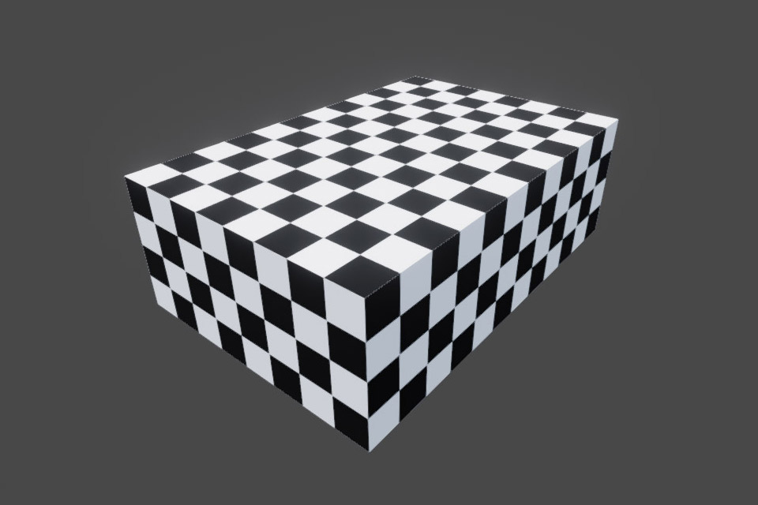

# Material Tiling

One of the most powerful features included in the **Graphics Utils** package is the ability to auto tile materials based on the object's scale. In doing so, new materials are created that are unique to the object. This makes the workflow of creating materials for tiled objects effortless. Without this feature, you often end up creating dozens of variants of a material just to change the tiling values for different objects.

Add the [AutoTile](/api/Zigurous.Graphics/AutoTile) script to the object you want to tile. The main property that is usually edited is `submeshes`. Each element in the array indicates how a submesh of the mesh is tiled, such as which axis the object is tiled on, the unit scale of the object, the texture offset, etc. For example, a plane is usually tiled around the Y+ axis, has a unit scale of 10, and only 1 submesh.

## 🕋 Cube Tiling

When tiling cubes, the [AutoTile](/api/Zigurous.Graphics/AutoTile) script gives the best results when used with the `Cube-Tiling.mesh` asset instead of Unity's default cube mesh. This mesh asset is split into 3 separate submeshes so you can tile each axis independently from the others. The mesh also has custom UV coordinates so the materials are tiled from the center of each axis. Using the custom tiling mesh, the script should be set up with 3 submeshes tiled around the X+, Y+, and Z+ axis, respectively, and the unit scale set to 1.

